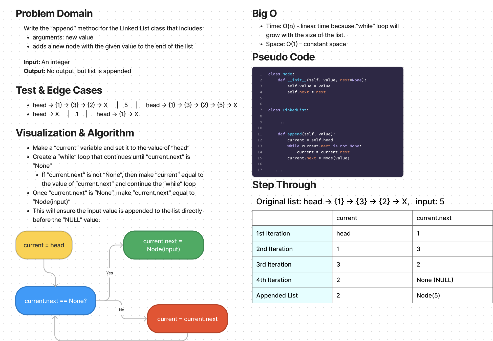

# Challenge Summary

* Write the following methods for the Linked List class:
  * append
    * arguments: new value
    * adds a new node with the given value to the end of the list
  * insert before
    * arguments: value, new value
    * adds a new node with the given new value immediately before the first
    * node that has the value specified
  * insert after
    * arguments: value, new value
    * adds a new node with the given new value immediately after the first node that has the value specified

## Whiteboard Process

## Approach & Efficiency

I did the white board for the `append` method of the Linked List function. To insert the input value at the end of the list (before the `NULL` value):
* Set `current` to `self.head`
* Create a `while` loop to run until `current.next` is equal to `None`
  * If not, then set `current` to equal `current.next` and continue the `while` loop
* Once `current.next` is equal to `None`, then set `current.next` to `Node(input)`
* This will add the input value to the end of the list before the `NULL` value.

Efficiency:
* Time: O(n) - linear time since the `while` loop will run for the length of the original Linked List
* Space: O(1) - constant space since the variables do not grow with the length of the Linked List

## Solution

The solution code is located in the `data_structures/linked_list.py` file.

1. Within the virtual environment, install pytest via `pip install pytest`.
2. From the Python folder, run tests via `pytest tests/code_challenges/test_linked_list_insertions.py`.
3. All 8 tests passed.

Example 1:
* Original Linked List: head -> {1} -> {3} -> {2} -> X
* Input: 5
* Output: head -> {1} -> {3} -> {2} -> {5} -> X

Example 2:
* Original Linked List: head -> X
* Input: 1
* Output: head -> {1} -> X

## API

* `insert` takes in a `value` sets `self.head` equal to `Node(value, self.head)`. So the head becomes a new `Node` which has a `value` of the input and `next` being the current value of the head.
* `includes` tries to find a input value in the linked list. It takes in a `value` and sets `current` equal to `self.head` and runs a `while` loop until `current` is equal to `None`. If the `current.value` equals the input `value`, then the method returns `True`. If not, the loop sets `current` equal to `current.next` and continues the loop. If the `current` value becomes `None`, then the linked list does not contain the input value and the method returns `False`.
* `__str__` returns the linked list as a string. It sets `current` equal to `self.head`, creates an emtpy `string` variable, and runs a `while` loop until `current` is equal to `None`. While `current` does not equal `None`, then the string is appended with `{ } ->` that contains the `current.value` inside the curly brackets. Once `current` equals `None`, `string` is appended with `NULL`. The `string` variable now contains all values of the linked list and ends with "NULL".
* `append` adds the input value to the end of the list before the `NULL` value.
* `insert_before` adds an inout value before another a specified input
* `insert_after`adds an inout value before another a specified input
